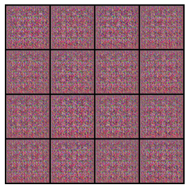

## Generative Adversarial Network (GAN) – From Scratch

This project is an experimental implementation of a **Generative Adversarial Network (GAN)** built from scratch in Python.  
The goal is to explore how adversarial training works at a low level, without relying on high-level deep learning frameworks abstractions.

The system is composed of two competing models:
- A **Generator**, which learns to produce synthetic data resembling the target distribution.
- A **Discriminator**, which learns to distinguish between real samples and generated ones.

Both models are trained simultaneously in a minimax game, where the generator improves by trying to fool the discriminator, and the discriminator improves by becoming more accurate.

### Key characteristics
- Manual implementation of the GAN training loop
- Explicit separation between generator and discriminator logic
- Loss-driven adversarial optimization
- Focus on understanding training dynamics rather than model scale
- Educational / experimental purpose

This project is intended as a learning exercise to better understand adversarial learning, model competition, and training stability issues commonly found in GANs.

## Preview

  

